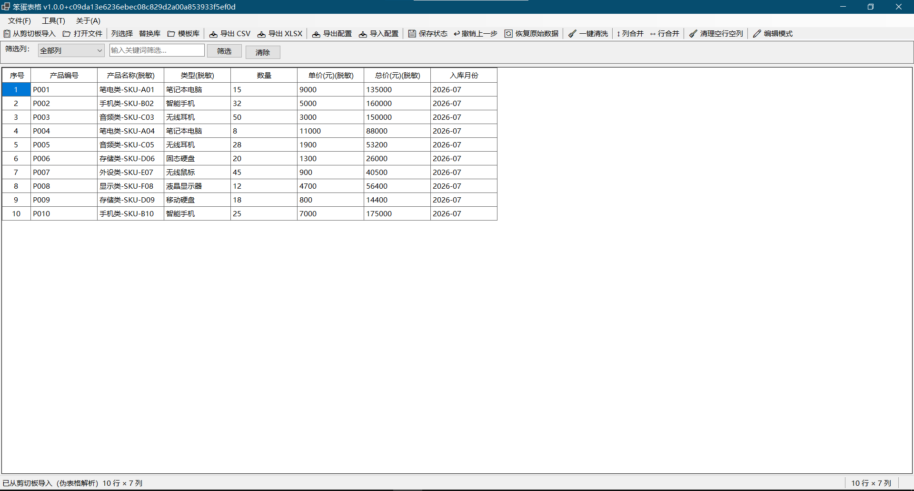
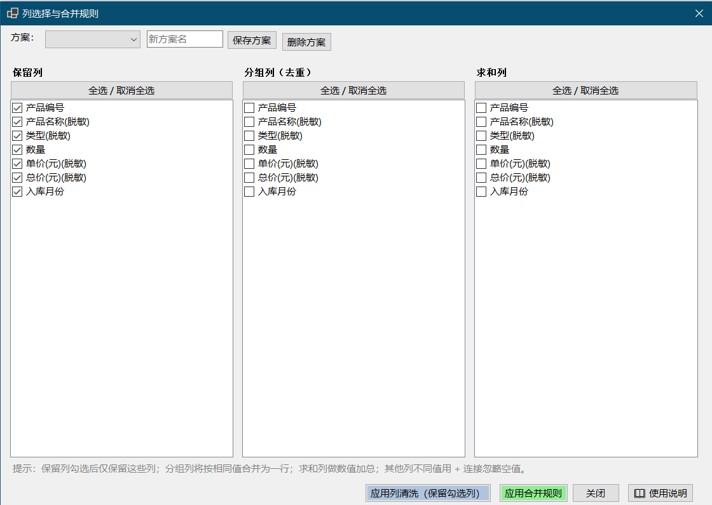
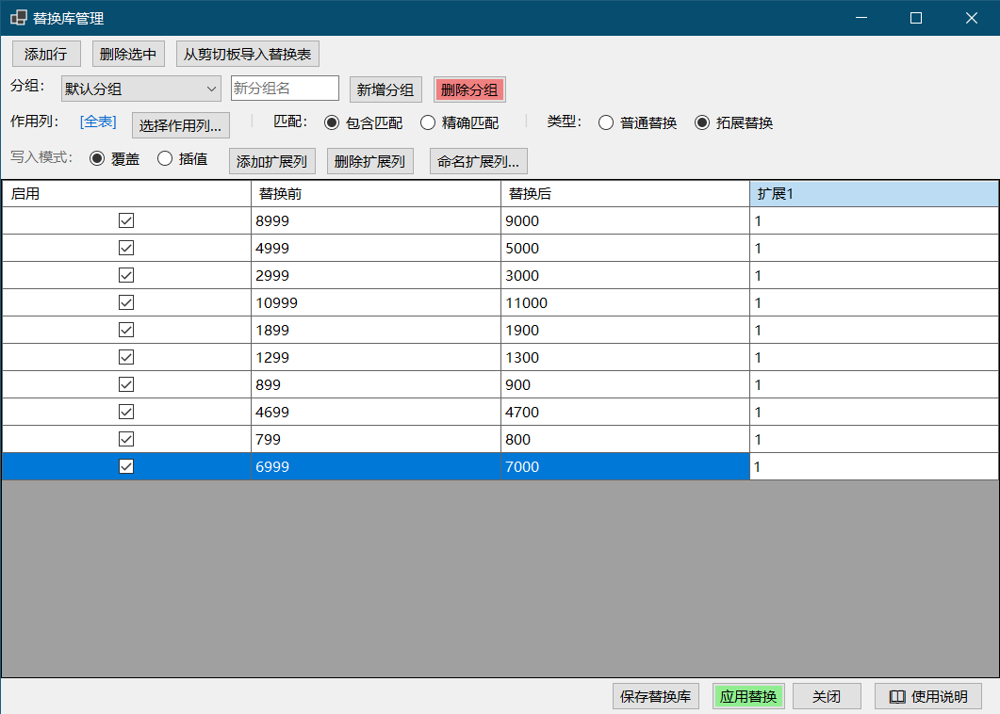
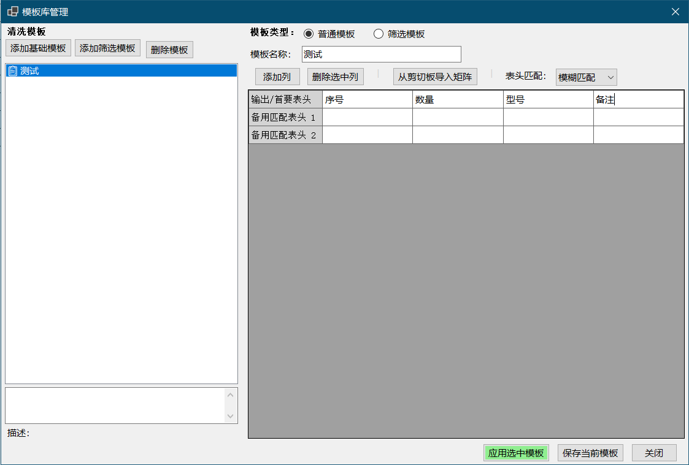

# 笨蛋表格



> 把重复、零散、难整理的表格，变成一键可复用的处理流程。

你是否需要频繁、机械化地处理某些表格，或反复整理报表？

**笨蛋表格**是一款面向 Windows 的表格模板化处理工具。哪怕是笨蛋，也能迅速完成重复性的表格编辑任务。

**[下载最新版本](https://github.com/wet86y/table-cleaner/releases/latest)** · **[提交问题或建议](https://github.com/wet86y/table-cleaner/issues)**

## 它能解决什么问题？

- 从 Excel/WPS、网页或聊天工具复制表格，直接从剪贴板导入，无需手动粘贴到单元格。
- 清洗单列的 `|`、TAB、逗号、分号或多空格分隔的“伪表格”，还原为真正的行列数据。
- 将格式不同、列名不一致的多份报表映射到统一格式。
- 按业务字段去重合并，同组数据自动求和，其余不同值自动汇总。
- 通过可保存的规则库和模板库，把反复操作变成一键流程。

## 核心功能

| 功能 | 说明 |
| --- | --- |
| 多种方式导入与导出 | 支持剪贴板、CSV、TXT、XLS 和 XLSX；Excel 文件可切换处理不同工作表，并可导出 CSV、XLSX 和整套配置包。 |
| 制式修订方案 | 通过自定义方案定义保留列、分组列、去重列和求和列，对来源各异的表格进行统一的制式修订；常用方案可保存并一键复用。 |
| 汇总合并 | 同一分组的数据自动合并为一行，数值列自动求和，其他列的不同非空内容汇总连接。 |
| 替换规则库 | 支持全表或指定列的包含/精确匹配，以及覆盖、插值两种拓展替换，适合编码映射和字段补全。 |
| 模板库 | 通过目标表头和备用表头将不同来源的数据归纳到统一列结构；筛选模板还可按匹配值筛选和组合数据。 |
| 日常整理 | 一键清洗伪表格、行/列合并、清理空行空列、筛选、编辑、复制粘贴、撤销和恢复原始数据。 |

## 功能演示

主界面支持从剪贴板或文件导入数据，并将常用操作集中在工具栏。以下是方案、替换库与模板库的实际操作界面：

### 通过方案完成制式修订与汇总

为不同业务表格保存一套制式修订方案：选择保留列、分组列、去重列和求和列，之后可重复应用。相同分组的数据会合并为一行，数值列自动求和，其余不同非空内容自动汇总。



### 替换规则库

将多组“替换前 / 替换后”数据保存为规则库，支持全表或指定列范围应用，并提供包含匹配和精确匹配两种方式。除了普通替换，还支持拓展替换：命中后可覆盖或插入右侧的连续列数据，适合编码映射、字段补全等批量处理。



### 模板库

通过目标表头和备用表头定义清洗模板，把来源不同的表格自动归纳到统一列结构。筛选模板还可按匹配值筛选和组合数据，减少跨系统报表整理时的重复调整。



### 日常整理工具

- 一键将伪表格文本转换为标准表格。
- 将多行或多列中分散的非空数据归并到目标行或列。
- 清理空行、空列，快速筛选数据。
- 支持单元格编辑、增删行列、复制粘贴、操作撤销和恢复导入时的原始数据。

## 快速开始

1. 前往 [Releases](https://github.com/wet86y/table-cleaner/releases/latest) 下载 `table-cleaner.exe`。
2. 双击运行 `笨蛋表格.exe`；这是 Windows x64 自包含单文件程序，无需安装 Office、WPS 或 .NET Runtime。
3. 点击“从剪贴板导入”或“打开文件”，处理完成后导出 CSV 或 XLSX。

> Windows 对未签名的新程序可能显示安全提示。请确认下载来源为本仓库的 GitHub Release 后，按系统提示选择保留或运行。

## 从源码运行

开发环境需要 Windows 和 .NET 8 SDK。仓库使用 Git submodule 管理共享更新组件，请递归克隆：

```powershell
git clone --recurse-submodules https://github.com/wet86y/table-cleaner.git
Set-Location .\table-cleaner
dotnet build .\src\TableCleaner\TableCleaner.csproj -c Release
.\scripts\run-self-check.ps1
```

如果已经普通克隆过仓库，初始化子模块即可：

```powershell
git submodule update --init --recursive
```

本地构建产物位于 `build\bin\Release\笨蛋表格.exe`。需要制作正式单 EXE 发布包时运行：

```powershell
.\scripts\build-release.ps1
```

发布产物位于 `artifacts\笨蛋表格-win-x64\笨蛋表格.exe`。

## 项目结构

- `src\TableCleaner`：WinForms 应用源码。
- `shared\DesktopUpdateKit`：以 Git submodule 接入的共享更新组件。
- `scripts`：构建、验证和 Release 资产脚本。
- `docs`：设计、构建、发布和维护文档。

贡献前请阅读 [CONTRIBUTING.md](CONTRIBUTING.md)，并运行 `scripts\run-self-check.ps1`。

## 技术栈

- .NET 8 / WinForms
- ClosedXML
- ExcelDataReader

## 致谢

项目使用 [DesktopUpdateKit](https://github.com/wet86y/DesktopUpdateKit) 提供应用更新能力，相关归属见 [THIRD-PARTY-NOTICES.md](THIRD-PARTY-NOTICES.md)。
